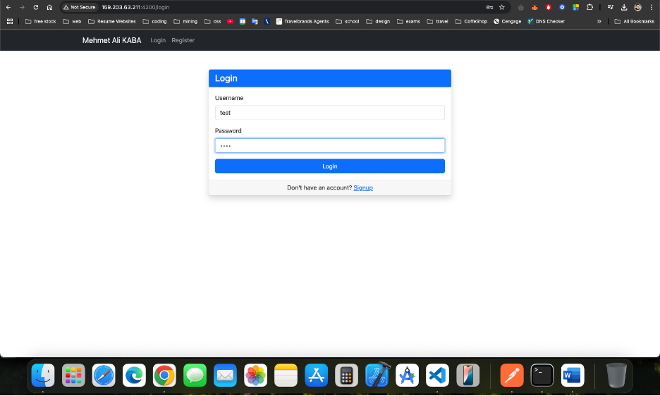
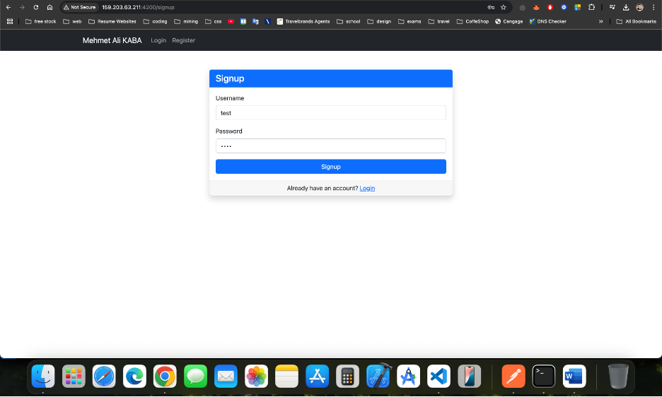
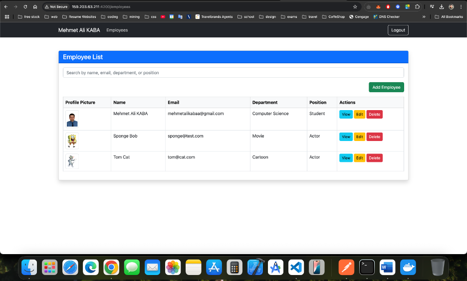
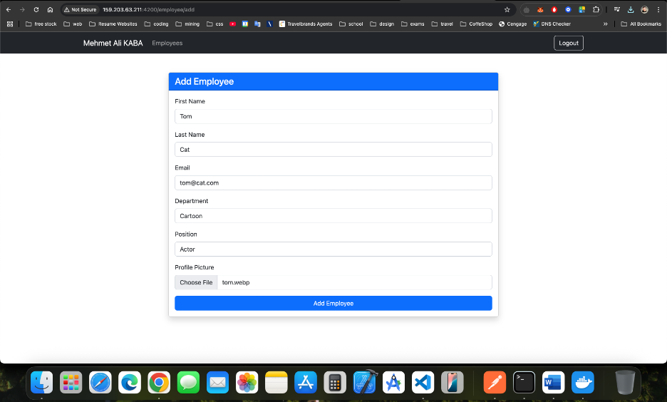
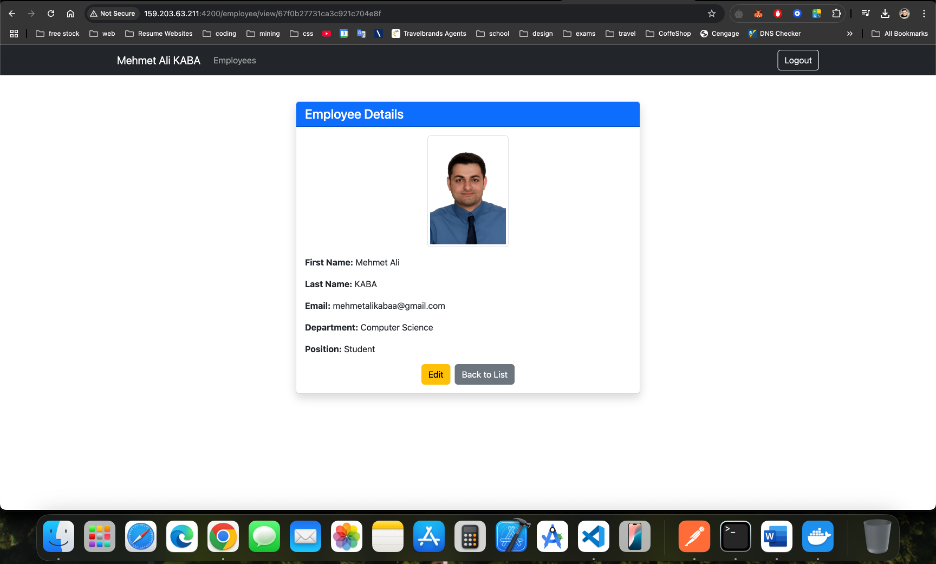
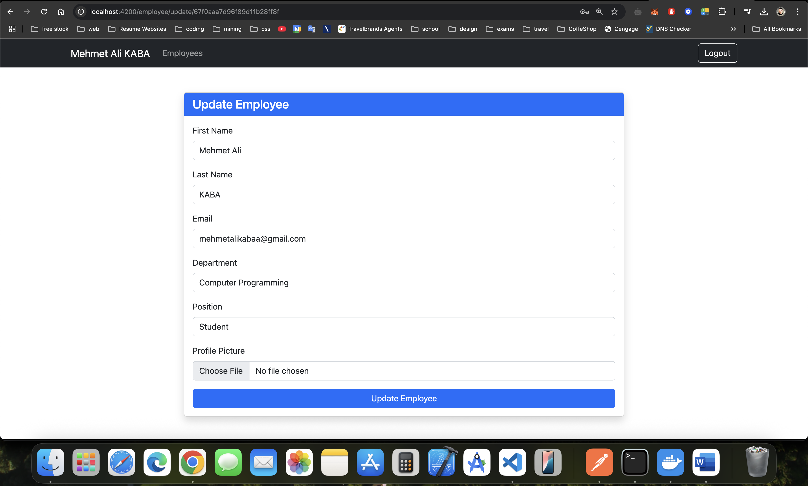

# Employee Management System

A full-stack employee management application built using:

- **Frontend**: Angular 16+ (Standalone Components, SCSS, Bootstrap 5)
- **Backend**: Node.js, Express, GraphQL (Apollo Server)
- **Database**: MongoDB
- **Authentication**: JWT
- **Deployment**: Docker + Docker Compose

## Features

### 🔐 Authentication
- User Signup & Login (JWT-based)
- Role-based access to employees created by a specific user

### 👨‍💼 Employee Management
- Add, view, update, and delete employees
- Upload and preview profile pictures
- Filter employees dynamically

### 🌐 GraphQL API
- Queries and Mutations for user and employee management
- Integrated with MongoDB via Mongoose

### 📦 Dockerized Deployment
- Runs frontend, backend, and MongoDB via Docker Compose
- Production-ready Nginx configuration for Angular

---

## 🛠️ Technologies Used

| Frontend | Backend | Database | Deployment |
|----------|---------|----------|------------|
| Angular  | Node.js | MongoDB  | Docker     |
| Bootstrap| Express | Mongoose | Nginx      |
| RxJS     | GraphQL |          | Compose    |

---

## 🔧 Local Development

### Prerequisites
- Docker & Docker Compose

### Run the app

```bash
docker-compose build
docker-compose up
```

Visit:
- Frontend: http://localhost:4200
- Backend: http://localhost:6000/graphql
- Mongo Express: http://localhost:8081

---

## 📂 Folder Structure

```
.
├── backend
│   ├── models/
│   ├── resolvers/
│   ├── services/
│   └── index.js
├── frontend
│   ├── src/
│   ├── Dockerfile
│   └── nginx.conf
├── docker-compose.yml
└── README.md
```

---

## 📸 Screenshots

Below are screenshots from the application:

### 1. Login Page


### 2. Register Page


### 3. Employee List


### 4. Add Employee


### 5. View Employee


### 6. Update Employee


---

## 🙌 Contributing

Pull requests are welcome! For major changes, please open an issue first.

---

## 📝 License

This project is licensed under the MIT License.